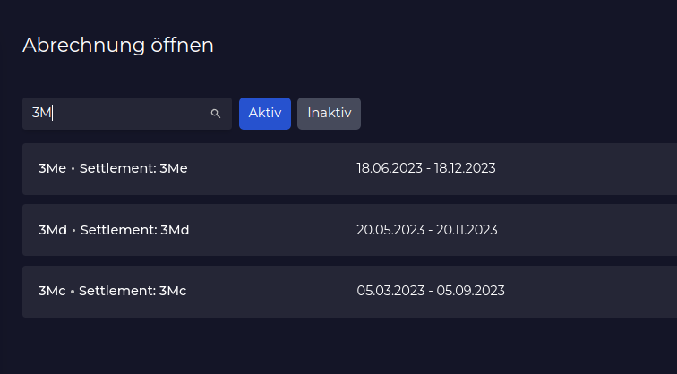

# Tipps und Tricks

## Shortcuts

### Ctrl+K
Überall, wo ein Listenfilter zu sehen ist, kann dieser mit Ctrl+K aktiviert werden. Wenn du während des Suchens Enter drückst, wird die Standardaktion mit dem obersten Listenelement durchgeführt.

