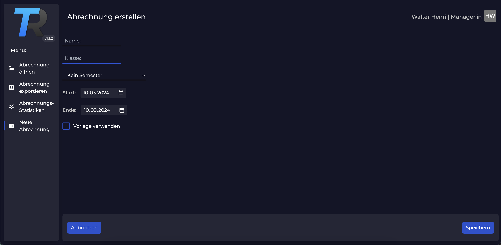

# Trilliun Anleitung

1. [Abrechnung erstellen](#abrechnung-erstellen)
2. [Abrechnungsübersicht](#abrechnungsübersicht)
3. [Abrechnungseinstellungen](#abrechnungseinstellungen)
4. [Rechnung erstellen](#rechnung-erstellen)
    1. [Spezialfälle bei der Rechnungserstellung](#spezialfälle-bei-der-rechnungserstellung)
5. [Status der Abrechnungsperiode](#status-der-abrechnungsperiode)
6. [Export](#export)

## Abrechnung erstellen

Um eine Abrechnung zu erstellen, klicken Sie auf den Button `Neue Abrechnung`. Es öffnet sich eine neue Ansicht, in dem Sie die Abrechnungsperiode auswählen können. Die Abrechnungsperiode ist der Zeitraum, für den die Abrechnung erstellt werden soll. Sie können die Abrechnungsperiode auch manuell eingeben. Klicken Sie auf `Speichern`, um die Abrechnung zu erstellen.

## Abrechnungsübersicht
## Abrechnungseinstellungen
## Rechnung erstellen
### Spezialfälle bei der Rechnungserstellung
## Status der Abrechnungsperiode
## Export